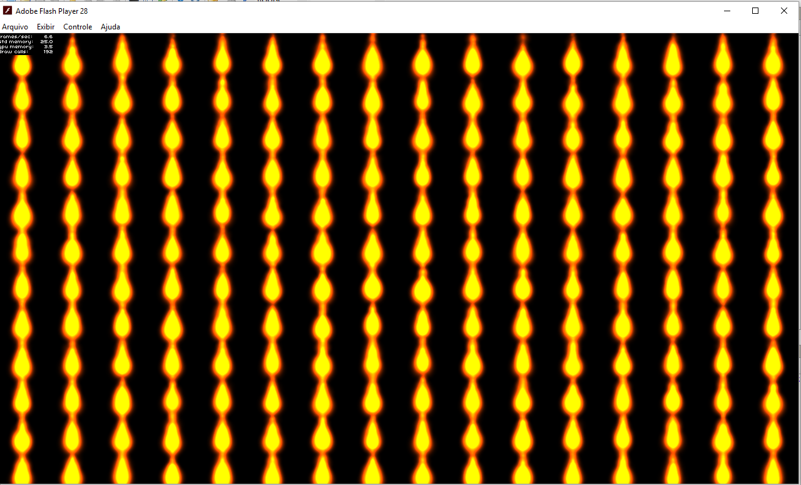
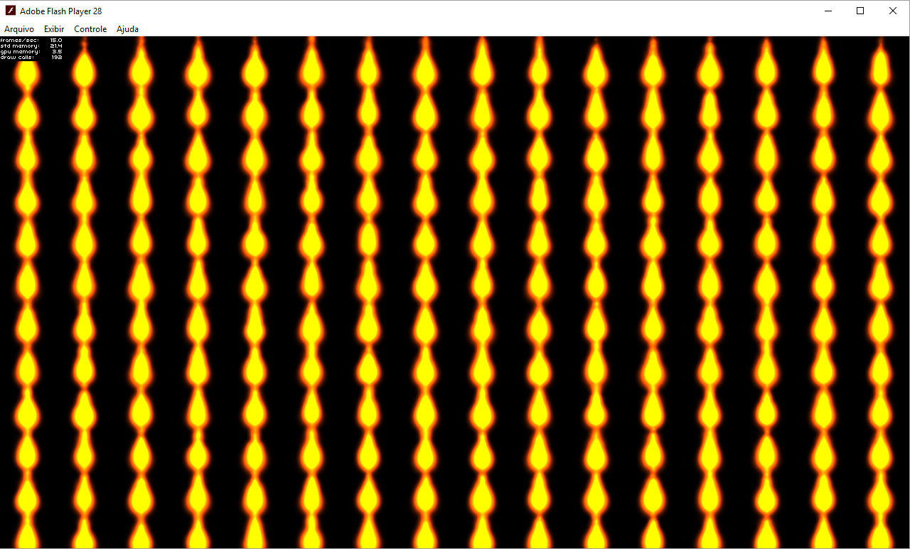
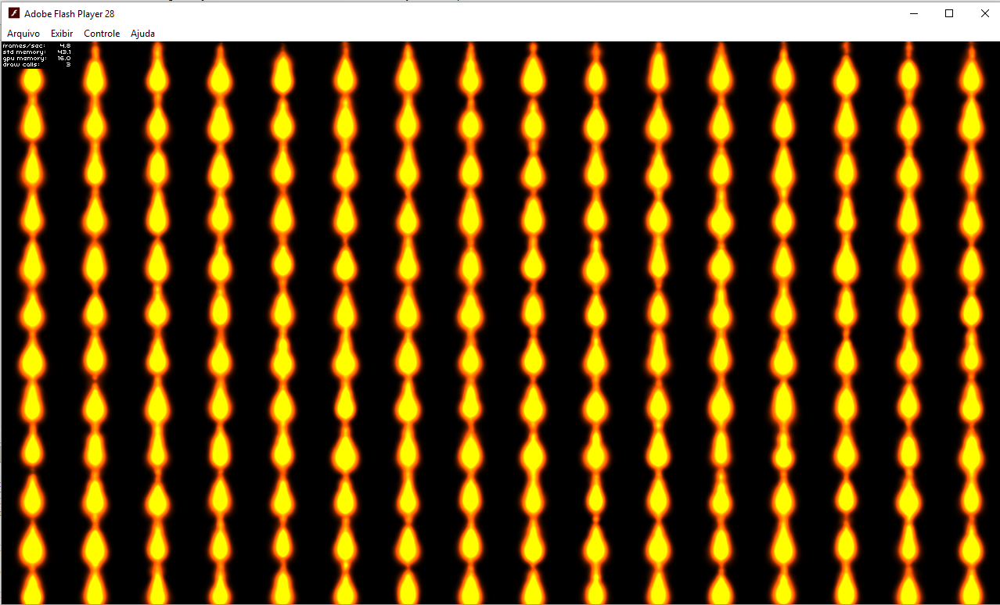
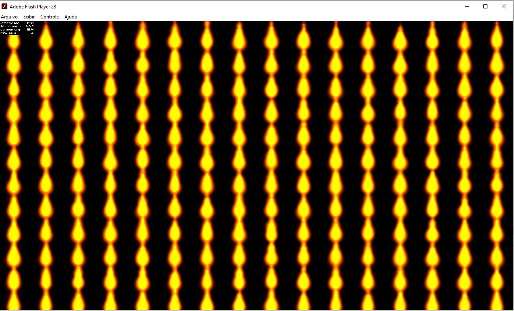

Batch test
=========

Without BATCH - More draw calls and more FPS
-------------------------------------------

With BATCH - Less draw calls but less FPS
----------------------------------------

Starling Extension: Particle System
===================================

The Starling Particle System classes provide an easy way to display particle systems from within the [Starling Framework][1]. That way, adding special effects like explosions, smoke, snow, fire, etc. is very easy to do.

The extension consists of three classes:

1. `Particle`: stores the state of a particle, like its position and color
2. `ParticleSystem`: the base class for particle systems. Implements a very simple particle movement. To create a custom particle system, extend this class and override the methods `createParticle`, `initParticle`, and `advanceParticle`.
3. `PDParticleSystem`: a particle system subclass that can display particle systems created with the  [Particle Designer][2] from 71squared.

Installation
------------

Which version to download depends on the Starling version you are using:

* If you work with a release version of Starling, download the Particle System with the equivalent tag (Starling 1.1 -> Particle System 1.1).
* If you work with the latest development version of Starling, download the head revision of the Particle System. 

After downloading, you will find the three classes described above in the `src`-directory. You can either copy them directly to your Starling-powered application, or you add the source path to your FlexBuilder project.

Demo-Project
------------

The `demo`-directory contains a sample project. To compile it, add a reference to the Starling library and add the source directory that contains the particle system classes.

The project contains 4 sample configurations. Switch between configurations in `Demo.as` by 
hitting the space bar.

Sample Code
-----------

The class `ParticleSystem` extends `DisplayObject` and behaves accordingly. You can add it as a child to the stage or any other container. As usual, you have to add it to a juggler (or call its `advanceTime` method once per frame) to animate it.

    // create particle system
    _particleSystem = new PDParticleSystem(psConfig, psTexture);
    _particleSystem.emitterX = 320;
    _particleSystem.emitterY = 240;
    
    // add it to the stage and the juggler
    addChild(_particleSystem);
    Starling.juggler.add(_particleSystem);

    // start emitting particles
    _particleSystem.start();

    // stop emitting particles
    _particleSystem.stop();

More information
----------------

You can find more information in the [Starling Wiki](http://wiki.starling-framework.org/extensions/particlesystem).

[1]: http://www.starling-framework.org
[2]: http://particledesigner.71squared.com
